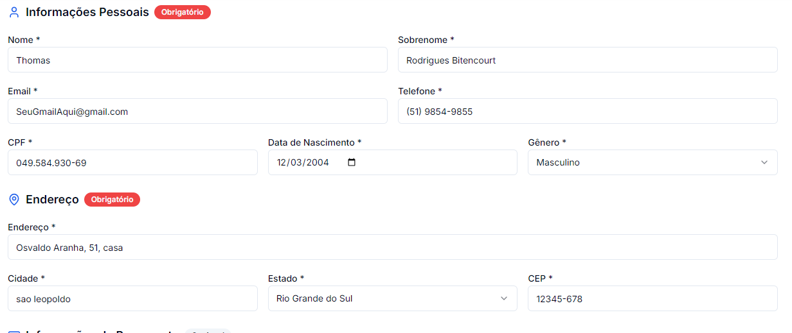
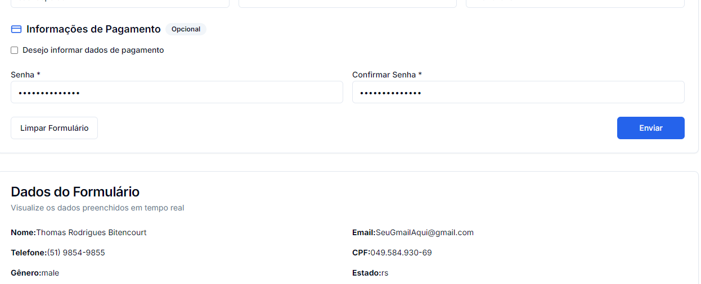

# Auto formulario

sobre o projeto: nessa primeira versão fiz uma automação que utiliza a biblioteca pyautogui para abrir, preencher e enviar um formulario, é apenas um exemplo do pyautogui que pode ser usado para gerenciar arquivos, organizar, etc...

## Tecnologias
° Pyautogui
° Python
° Visual Studio Code
° Pyperclipe
° Time

## Funcionalidades
° Ativa a tecla Windows
° Abre o navegador chrome
° Abre o site do formulario
° Preenche todos os dados e envia o formulario

## Como rodar o codigo
° Instalar as bibliotecas: pyautogui e pyperclipe
° Executar: python formulario.py

## Limites
Dependendo da tela do windows, pode variar a coordenada do clique

## melhorias para a proxima versão: v2
° Utilizar Selenium ou Playwright em vez de coordenadas fixas.
° Ler os dados de um arquivo CSV ou Excel.
° Permitir preencher vários formulários automaticamente.

## Exemplo do formulario:

